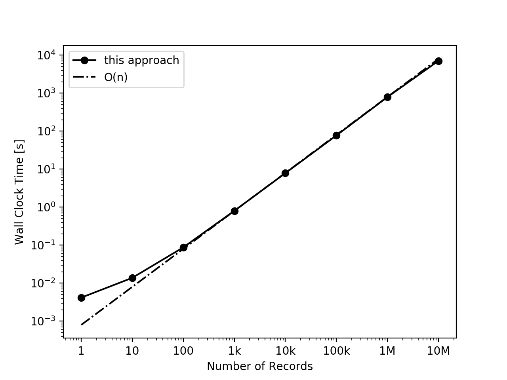

# Insight Data Engineering Coding Challenge: Donation Analytics

## Table of Contents
1. [Summary of the Challenge](README.md#summary-of-the-challenge)
1. [Summary of the Algorithm and the Implementation](README.md#summary-of-the-algorithm-and-the-implementation)
1. [Performance and Scalability](README.md#performance-and-scalability)
1. [Extra Features](README.md#extra-features)
1. [Tests](README.md#tests)
1. [Summary](README.md#summary)

## Summary of the Challenge:
A series of donation records stream in from a file, line-by-line. 
Each record lists some information about the donor, the recipient and the donation. 
As each record comes in, emit the following as a new line in a file if the donor is a repeat donor: 

    Recipient|Zip|Year|Repeat Donation x-Percentile Amt.|Repeat Donation Total Amt.|# Rep. Donations 

The percentile value used when finding `x-Percentile Amt.` will be read from a file. 
Assume that the records can have missing or malformed data so do some validity checks to skip such 
records.

See [the full description of the challenge](https://github.com/InsightDataScience/donation-analytics/blob/master/README.md).

[Back to Table of contents](README.md#table-of-contents)


## Summary of the Algorithm and the Implementation:
The following algorithm is implemented using Python 3.6 came in Anaconda 3 distribution. 
Although I used an Anaconda distribution, I have only used modules that are present in standard 
Python 3.6 library.

1. Read the next available record and check if it is valid.
   1. If the record is valid mold it to `namedtuple` and return that data structure. 
      In this data structure, define each donor with a key (i.e. `donorID`) which is composed of 
      the donor's name and zip code.
      In addition, define each donation group with key (i.e. `groupID`) which is composed of the 
      recipient, donor's zip code and the donation year.
   1. If the record is not valid return null.
1. If a valid record is returned proceed to the next step. Otherwise loop back to Step 1.
1. Check if the donor is a repeat donor.
   A donor is a repeat donor if it's `donorID` is found as a key in  a `dict` called `donors` which 
   hash-maps each `donorID` to a `set` of years<sup>\*</sup> that the donor donated within.
   1. If the donor is a repeat donor, 
      1. Append the donation amount to a `list` hash-mapped to this `groupID` in a `dict`.
      1. Accordingly, increment a running sum which is hash-mapped to this `groupID` in another `dict`. 
      1. Compute the desired percentile value and emit the updated values in the format requested.
   1. If the donor is not a repeat donor, add that donor to the `donors` `dict`.
1. Add the donation year of that donor to its corresponding `set` of donation years.
1. Loop back to Step 1.

I used hashable data structures (i.e. `set`, `tuple` and `dict`) to contain all immutable data, since 
these data structures allow looking-up and setting in O(1) on average.
The donations mentioned in 3.i.a are stored in a `list` so that it could be sorted as required by the
percentile computations.
While this sorting operation is performed for every repeat donation, it does not make a super-linear 
impact on overall run time because
1. The sum of this `list` is not recomputed; instead, it is updated as a running total within a loop
   one-level outside.
   This avoids the O(k) impact of a `sum()` operation within the innermost loop.
1. All other operations done on this `list` (`len()`, look-up and append) take O(1)   
1. The length of a typical `list` is much smaller than total number of records, i.e. `k` << `n`.
1. The `list` comes pre-sorted from a previous update except for its last element newly appended.
   The `.sorted()` method, which implements Timsort algorithm takes O(k), not O(klogk), time by adapting
   to insert sort if the list is almost sorted like this. 

As shown in [Performance and Scalability](Readme.md#performance-and-scalability) all these 
considerations made the per-record time complexity about O(1) time, making the overall run time 
comlexity about O(n) where n is the number of records in the file. 

Footnotes:

<sup>\*</sup>  *Dealing with ambiguity*:
By default, this set of years include all the years donor has made any donation to any recipient. 
The challenge rules, however, state that
  
>... if a donor had previously contributed to any recipient listed in the `itcont.txt` file 
 in any *prior* calendar year, that donor is considered a repeat donor.

(*emphasis* is mine). 
This means that, if a donor has donated multiple times only within the current year, 
those donations are *not* counted as repeat donations.
However, multiple donations within a prior year gets counted as repeat.
This did not really make much sense to me, especially due to the fact that some records can come in
non-chronological order.
Nevertheless, I devised the command line option `-s`, which sets `strictRepeat = True`, to allow for 
this type of an accounting, just in case. When this option is turned-on, the current year is excluded
from that `set` of donation years. 
   
<sup>\*\*</sup> As per the challenge rules, there is no distiction made here as to what recipient the 
donor donates to '--' a subsequent donation to *any* recipent qualifies as a repeat donation.

[Back to Table of contents](README.md#table-of-contents)

## Performance and Scalability:

This plots demonstrates the performance and the scalability of my approach.
I generated this data by running the script for the first n = 1, 10, 100, 1k, 10k, 100k, 1M and 10M
records grabbed from the `itcont.txt` file provided in FEC web site for the year 2016. 
My algorithm and implementation scales nearly linearly up to a record length of 10M.
Note that the complete year-2016 file, which is the largest one provided, has slighly more than 20M 
records, which can be processed in about 4 hours.
The number of records skipped in each batch was less than 10% of n, therefore plotting against the
number of valid records did not make a noticeable difference. 



[Back to Table of contents](README.md#table-of-contents)


## Extra Features:
My code writes a log file that lists what files were read-in or written-out, how many records were 
processes or skipped and how long the whole process took. 
If the command line option `-v` is given, the output becomes more verbose by listing what records 
were skipped and why.

```
Opened
./test_2016/output/repeat_donors_10k.txt
to output the repeat donation stats in the following format:
| Receipent | Donors Zip Code| Donation Year| 30 Percentile Amount | Total Repeat Donation Amount| Number of Repeat Donations
The requested percentile value is read from:
./test_2016/input/percentile.txt
Started processing records present in:
./test_2016/input/itcont_10k.txt
See the end of this log file for a process summary.
-------------------------------------------------------------------------------
Skipping record 820 because "ZIP_CODE" field does not exits, it is empty, or malformed:
Skipping record 821 because "ZIP_CODE" field does not exits, it is empty, or malformed:
Skipping record 822 because "ZIP_CODE" field does not exits, it is empty, or malformed:
Skipping record 938 because "OTHER_ID" field is not empty: C00484535
Skipping record 942 because "OTHER_ID" field is not empty: H6CA53047
Skipping record 943 because "OTHER_ID" field is not empty: H6CA53047
Skipping record 944 because "OTHER_ID" field is not empty: H6CA53047
Skipping record 946 because "OTHER_ID" field is not empty: H2SC07108
...
-------------------------------------------------------------------------------
Gone through a total of 10000 records.
Processed 9237 valid records.
Skipped   763 invalid records.
DONE in 7.737484 seconds of wall clock time
```
In addition, my code automatically finds-out the column numbers of the requested fields from a header 
file `indiv_header_file.csv` provided by FEC.
This increases the robustness of the program by eliminating the need for manually finding out and 
hard-coding the column numbers of the requested fields. 

[Back to Table of contents](README.md#table-of-contents)

## Tests:


[Back to Table of contents](README.md#table-of-contents)


## Summary:


[Back to Table of contents](README.md#table-of-contents)


